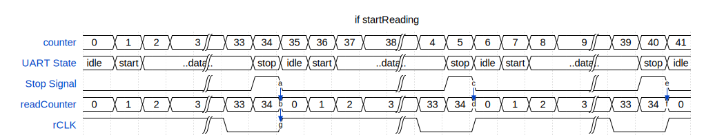

# Time-to-digital Converter using Tapped Delay Lines
--------------------------------------------------------------------
Final degree project for Electronic Engineering
- Author: Miqueas Filsinger
- Universidad Nacional del Sur

## Technical Information & Modules:

### Transmission & USART
- Constant speed of 115200 baud
- 8N1, (8 bits of data, 1 stop bit, not parity)
- None type of control used
- Double 0 byte at the start of transmission


### Modules Instantiation Hierarchy 

```
└── info.md
└── top_tb.v
    └── top.v
        └── TDC.v
            └── defines.v
            └── Coarse.v
            └── Edge.v
            └── Fine.v
            └── DecodeStart.v
            └── DecodeStop.v
            └── merging.v
        └── memory_ctrl.v
        └── uart_tx.v  
        └── TDC_pins.xdc
```

### Pins and Connections
| PACKAGE PIN    | COMPONENT       |Wire Name (top.v)| Note        |
|:--------------:|-----------------|:---------------:|-------------|
|     R3         |     DS2.2       |       clk_p     |     clk     |
|     P3         |     DS2.2       |       clk_n     |     clk     |
|    M26         |     DS2.2       |   led_WriteERR  |     led0    |
|    T24         |     DS3.2       |   led_ReadERR   |     led1    |
|    T25         |     DS4.2       | led_WriteStage  |     led1    |
|    R26         |     DS5.2       |  led_ReadStage  |     led1    |
|    T8          |      J33.1      |      hit_p      | Conector SMA|
|    T7          |      J34.1      |      hit_n      | Conector SMA|
|    P6          |      SW3.3      |   startReading  | Boton Norte |
|    U5          |      SW5.3      |   startWriting  | Boton Este  |
|    U4          |      SW8.3      |      but_rst    |  CPU Reset  |





